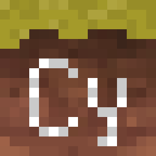
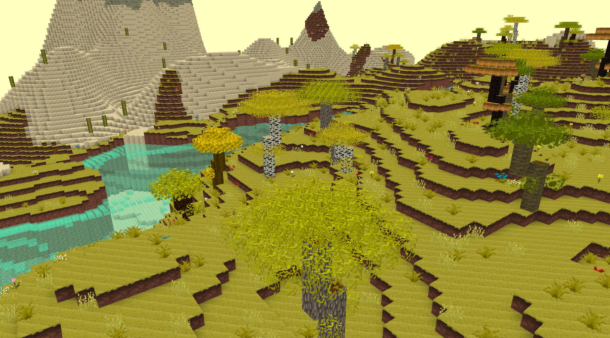

<p align="center">
    
    <h1 align="center">Cybrion</h1>
    <p align="center"><i>❝ Just a silly blocky game ❞ — <b>@qninhdt</b></i></p>
</p>

<p align="center">
    
</p>

## 💡 Features
- Infinite, procedurally generated world
- Multithreading for world generation
- Beautiful and colorful world
- Custom shape blocks (fence, chess, table)
- Wide variety of flowers and trees
- Save and load world using custom file type
- Complex GUI (Block menu, inventory)

## ⚙️ Installing


## 🔧 Building
### Windows
#### Requirements
- [Git](https://git-scm.com/)
- [CMake](https://cmake.org/)
- [Visual Studio 2015 or newer](https://visualstudio.microsoft.com/)

> _Don't forget to add CMake to environment variables_
#### Installing libraries and compiling
- __Step 1__: Open terminal and dowload source code
```batch
> git clone https://github.com/qninhdt/cybrion
```
- __Step 2__: Install vcpkg and libraries
```batch
> cd cybrion
> build.bat
```
- __Step 3__: Rerun build.bat to compile project
```batch
> build.bat
```

After compiling, executable files and resource files will be put in folder `cybrion/build`

To play game, you need to run `cybrion.exe` in that folder  

### Linux
#### Requirements
- [Git](https://git-scm.com/)
#### Installing libraries and compiling
- __Step 1__: Dowload source code
```bash
$ git clone https://github.com/qninhdt/cybrion
```
- __Step 2__: Run `build.sh`. It will install tools, libraries and compile automatically
```bash
$ cd cybrion
$ ./build.sh
```

Similar to __Windows__, build folder will be `cybrion/build`

## 📁 Project structure

    ├── resources           # Game textures, shader files and config files
    └── src                 # Source files
    |   ├── client              # Everything that relates to rendering, window, controls          
    |   |   ├── GL                  # OpenGL primitive elements (mesh, framebuffer, texture, ...)
    |   |   ├── graphic             # Handle rendering for block, world, sky, ...
    |   |   ├── resource            # Load config files, shader files and block textures
    |   |   └── ui                  # Handle user interface (inventory, menu, text, ...)
    |   ├── core                # Custom data structures and some useful classes
    |   ├── physic              # Handle physic (AABB, ...)
    |   ├── uitl                # Utility functions
    |   ├── world               # Manage world components (block, chunk, entity, ...)
    |   └── ...
    └── ...

## 🎮 How to play

### Hello world
- __Step 1__: Enter the name of your world then click `Create`
- __Step 2__: Click `Play`
- __Step 3__: Enjoy the game 🗿🍷

### Controls
- __`Left Click`__ to break a block
- __`Right Click`__ to place a block
- __`WASD`__ to move around
- __`Space`__ to go up
- __`Shift`__ to go down
- __`E`__ to open block menu
- __`Esc`__ to pause game
- __`Ctrl`__ to move faster
- __`F1`__ to hide GUI
- __`F3`__ to open Debug tools

