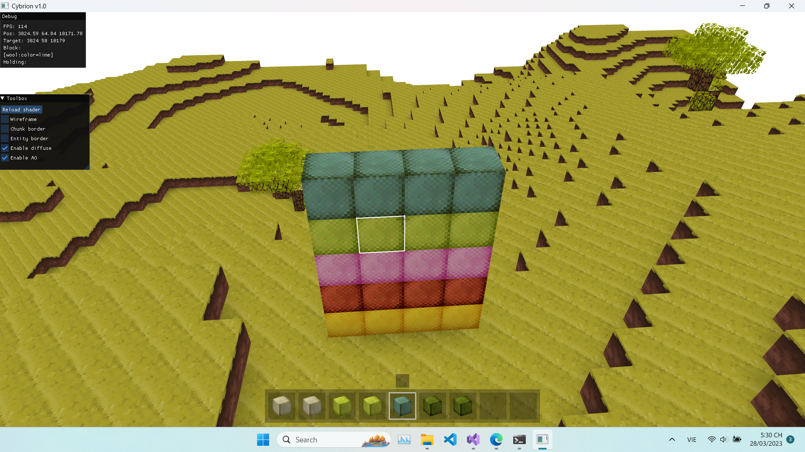
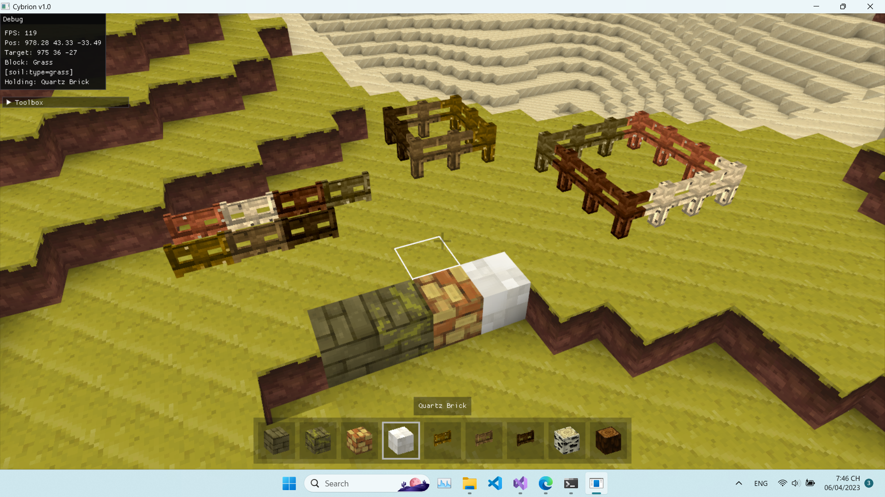
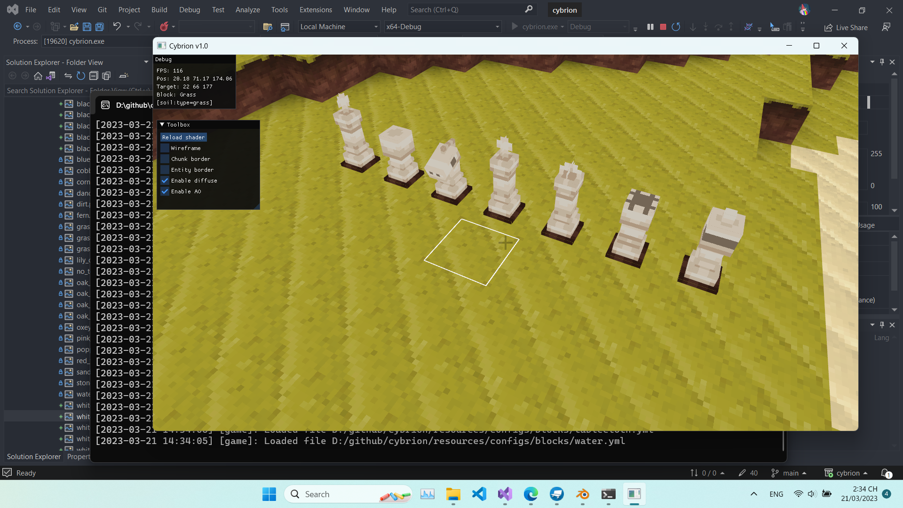

# CYBRION

## Preview

## Todo list
- [x] Render first chunk
- [x] Optimize chunk meshing
- [x] Simple world
- [x] Collision detection
- [x] Thread pool for loading chunk and meshing
- [x] Tree
- [x] Block sound
- [x] Water
- [ ] Glass
- [x] Custom block model (.obj)
- [x] Flower
- [x] Improve world generation
- [x] Inventory
- [x] Add sky
- [x] Save system
- [x] Game gui
- [ ] End

## Libraries
- glm
- lz4
- robin-hood-hashing
- spdlog
- bshoshany-thread-pool
- yaml-cpp
- sdl2
- imgui[opengl3-binding,sdl2-binding]
- concurrentqueue