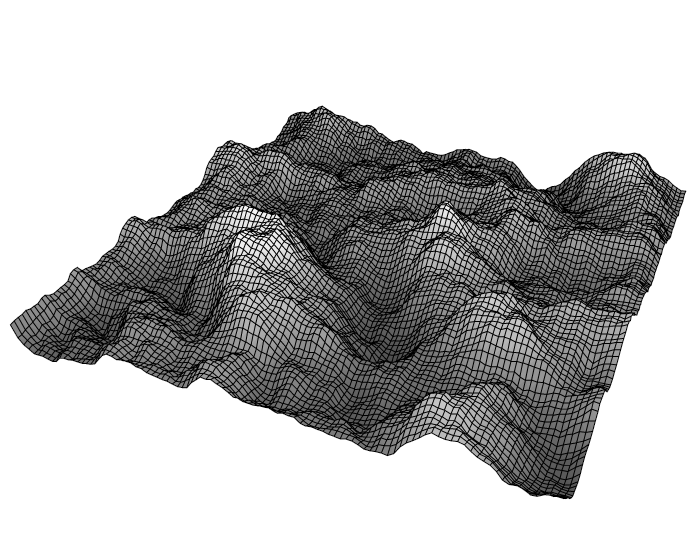
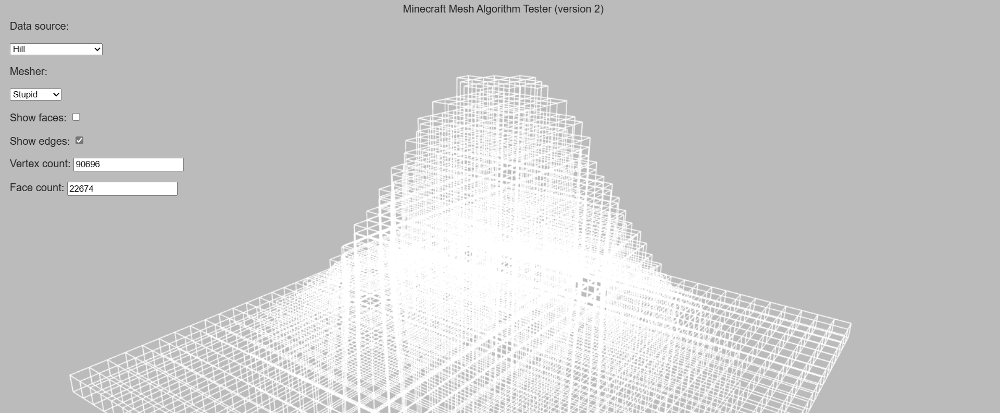
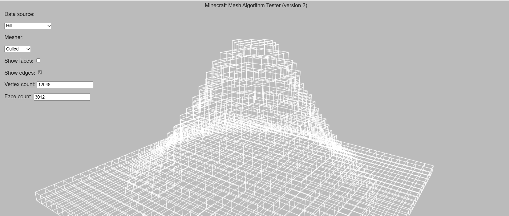

<p align="center">
    
    <h1 align="center">Cybrion</h1>
    <p align="center"><i>❝ Just a silly blocky game ❞ — <b>@qninhdt</b></i></p>
</p>


<p align="center">
    
</p>

## ✏️ Mô tả

__Cybrion__ là một trò chơi 3D được viết bằng ngôn ngữ C++ phiên bản 20 và sử dụng thư viện SDL2 để xử lý đồ họa. Trong Cybrion, người chơi sẽ được thỏa thích xây dựng bất cứ thứ gì bằng những khối có sẵn, trong một thế giới mở tuyệt đẹp, không bị giới hạn bởi không gian.

## 💡 Tính năng

- Thế giới mở, rộng vô hạn
- Nhiều loại khối như gỗ, đất, đá, xi măng. Nhiều loại hoa và loại cây
- Sử dụng đa luồng để sinh thế giới, giúp tăng hiệu suất trò chơi
- Có thể lưu và mở thế giới để chia sẻ với bạn bè
- Giao diện, đồ họa bắt mắt, dễ dùng

## 🎮 Hướng dẫn chơi

### Hello world

- __Bước 1__: Nhập tên thế giới muốn tạo rồi ấn nút `Create`
- __Bước 2__: Nhấn nút `Play` ở thế giới vừa tạo
- __Bước 3__: Enjoy the game 🗿🍷

### Điều khiển

- __`Chuột trái`__ : phá khối
- __`Chuột phải`__ : đặt khối
- __`WASD`__ : di chuyển
- __`Space`__ : bay lên
- __`Shift`__ : hạ xuống
- __`E`__ : mở túi đồ và chọn khối
- __`Esc`__ : tạm dừng
- __`Ctrl`__ : di chuyển nhanh hơn
- __`F1`__ : ẩn GUI
- __`F3`__ : mở công cụ debug

## 🖼️ Preview

- Loading . . .


## 🔧 Biên dịch mã nguồn
### Windows
#### Phần mềm yêu cầu:
- [Git](https://git-scm.com/)
- [CMake](https://cmake.org/)
- [Visual Studio 2015 hoặc cao hơn](https://visualstudio.microsoft.com/)

> _Thêm CMake vào biến môi trường (environment variables)_
#### Tải thư viện và biên dịch
- __Bước 1__: Mở cửa sổ cmd rồi tải mã nguồn từ Github
```batch
> git clone https://github.com/qninhdt/cybrion
```
- __Bước 2__: Tải vcpkg và thư viện
```batch
> cd cybrion
> build.bat
```
- __Step 3__: Chạy lại file `build.bat` để biên dịch
```batch
> build.bat
```

Sau khi biên dịch, các file cần thiết cho game sẽ xuất hiện trong thư mục `cybrion/build`

Chạy file `cybrion.exe` trong thư mục trên để chơi game  

### Linux
#### Phần mềm yêu cầu
- [Git](https://git-scm.com/)
#### Tải thư viện và biên dịch
- __Bước 1__: Tải mã nguồn từ Github
```bash
$ git clone https://github.com/qninhdt/cybrion
```
- __Bước 2__: Chạy `build.sh` để tự động tải thư viện, phần mềm cần thiết và biên dịch mã nguồn
```bash
$ cd cybrion
$ ./build.sh
```

Tương tự như trên __Windows__  thư mục chưa game là `cybrion/build`

## 📁 Cấu trúc mã nguồn

    ├── resources           # Chứa texture của game, file cấu hình, file shader, ...
    └── src                 # Mã nguồn
    |   ├── client              # Chứa mọi thứ liên quan đến cửa sổ, điều khiển, render          
    |   |   ├── GL                  # Xử lý OpenGL (mesh, framebuffer, texture, ...)
    |   |   ├── graphic             # Xử lý render khối, thế giới, bầu trời
    |   |   ├── resource            # Đọc file cấu hình, file shader, tải texture, ...
    |   |   └── ui                  # Xử lý giao diện (inventory, menu, text, ...)
    |   ├── core                # Chứa một vài cấu trúc dữ liệu quan trọng
    |   ├── physic              # Xử lý vật lý (AABB)
    |   ├── uitl                # Một số hàm hỗ trợ
    |   ├── world               # Quản lý thế giới, khối và người chơi
    |   └── ...
    └── ...

## 💻 Thuật toán của trò chơi

### Tổng quan

- Thế giới trong Cybrion được chia thành các chunk. Mỗi chunk có cấu tạo từ 32x32x32 khối. Thế giới sẽ lưu trữ các chunk dưới dạng map với key là 1 vector 3D gồm tọa độ x, y, z của chunk. (Tương tự như trong Minecraft, mỗi chunk có kích cỡ 16x256x16)
- Nhờ việc lưu trữ chunk bằng map thay vì mảng cố định hay vector mà thế giới có thể rộng vô hạn.
- Mỗi chunk chỉ được tạo hoặc đọc từ bộ nhớ khi cách người chơi một khoảng nhất định.
- Sử dụng thuật toán Perlin Noise để sinh thế :
  - Dựa vào tọa độ và một seed ( seed được tạo ngẫu nhiên từ khi tạo thế giới ) để tạo ra một ảnh noise (hình 1)
  - Từ ảnh noise, trò chơi sẽ sinh ra height map để phục vụ cho việc sinh thế giới (hình 2)
  - Tiếp theo ta cũng có thể sử dụng các yếu tố khác như độ cao để lựa chọn khối để đặt
  - _Đọc thêm: [Making maps with noise functions (redblobgames.com)](https://www.redblobgames.com/maps/terrain-from-noise/)_

 

<p align="center">
    
    
</p>


- Để thuận tiện cho quá trình lưu trữ thì mỗi block được cấp phát một ID duy nhất có giá trị nguyên dương. Ví dụ: id(AIR) == 0, id(DIRT) == 5, id(SAND) == 17, ...

### Khó khăn

- __Thế giới yêu cầu bộ nhớ quá lớn__

  - Mặc dù mỗi block có thể lưu trữ dưới dạng 1 số nguyên tuy nhiên số lượng block trong thế giới là vô cùng lớn

  - Với tầm nhìn là 8 (mặc định của trò chơi) thì số chunk cần lưu trữ ≈ 1700 chunk = 1700 x 32 x 32 x 32 = **55,705,600** block
  - Nếu trò chơi của ta có hơn 256 loại block thì ta cần 2 byte cho mỗi block => bộ nhớ cần dùng ≈ 100Mb
  - Vậy chỉ sau 10 phút di chuyển, khám phá trò chơi thì bộ nhớ cần dùng để lưu trữ thế giới có thể lên tới vài Gb (uy tín)
- __Tốn quá nhiều thời gian để render__

  - Tương tự như vấn đề trên, việc có quá nhiều khối tương đương với có quá nhiều vật thể cần được render.
  - Số block cần vẽ là **55,705,600** block, mỗi block lại có 6 mặt => số hình chữ nhật cần vẽ là **334,233,600** hình !
- __Không có cách lưu trữ phù hợp__:

  - File text, json: Tốn bộ nhớ, tốc độ đọc rất kém
  - Database: không phù hợp, quá phức tạp

### Cách giải quyết

- __Sử dụng cấu trúc dữ liệu Palette__:

  - Do trong mỗi chunk chủ yếu chỉ có từ 3 - 10 loại block khác nhau nên việc sử dụng 2 byte tương ứng với 65536 giá trị khác nhau là rất lãng phí. 

  - Palette là một cấu trúc dữ liệu tự động điều chỉnh bộ nhớ tùy thuộc vào số block khác nhau trong chunk, tận dụng triệt để từng bit trong một byte để lưu trữ

    | Số block khác nhau trong 1 chunk |   Tỉ lệ   | Số bit mỗi block | Kích cỡ chunk |
    | :------------------------------: | :-------: | :--------------: | :-----------: |
    |              1 - 2               |    Ít     |        1         |      4Kb      |
    |              3 - 4               | Rất nhiều |        2         |      8Kb      |
    |              5 - 16              |   Nhiều   |        4         |     16Kb      |
    |             17 - 256             |   Hiếm    |        8         |     32Kb      |
    |           257 - 65536            | Không có  |        16        |     64Kb      |

- __Sử dụng file JBT để lưu trữ thế giới__:

  - [JBT](https://github.com/qninhdt/jbt) hay "JSON-like binary tag" là một kiểu file lưu trữ dữ liệu dưới dạng nhị phân được mình phát triển nhằm mục đích vừa tận dụng sự dễ hiểu của json mà vừa có thể lưu trữ được dữ liệu lớn
  - JBT sẽ lưu chunk thành 1 region file có đuôi .hjbt. Một region sẽ chứa tối đa 32x32x32 chunk, tuy nhiên file này chỉ lưu trữ những chunk đã được sinh ra
  - Ngoài ra JBT còn sử dụng thuật toán [lz4](https://github.com/lz4/lz4) để nén dữ liệu trước khi lưu
  
- __Chỉ render những block có thể nhìn thấy__:

  - Ta ẩn những block mà 6 mặt xung quanh đều có block vì nó chắc chắn không thế nhìn thấy
  - Nhờ cách này mà ta có thể giảm đáng kể số block phải render từ *O*(n³) xuống *O*(n²)


<p align="center">
    
    
</p>


## 📦Thư viện

- [SDL2](https://github.com/libsdl-org/SDL) - Xử lý màn hình và điều khiển
- [glad](https://github.com/Dav1dde/glad)- Xử lý đồ họa
- [irrKlang](https://www.ambiera.com/irrklang/) - Xử lý âm thanh
- [glm](https://github.com/g-truc/glm) - Tính toán ma trận và vector
- [FastNoiseLite](https://github.com/Auburn/FastNoiseLite) - Tạo height map để sinh thế giới
- [imgui](https://github.com/ocornut/imgui) - Tạo giao diện người dùng
- [spdlog](https://github.com/gabime/spdlog) - Logging
- [yaml-cpp](https://github.com/jbeder/yaml-cpp) - Đọc file yaml
- [thread-pool](https://github.com/bshoshany/thread-pool) - Xử lý đa luồng
- [concurrentqueue](https://github.com/cameron314/concurrentqueue) - Thread-safe queue

## 🌟Credit

- __Texture pack:__ [Jolicraft ](http://jolicraft.com/)
- __Sound:__ : Minecraft
- __Font__: Minecraft


